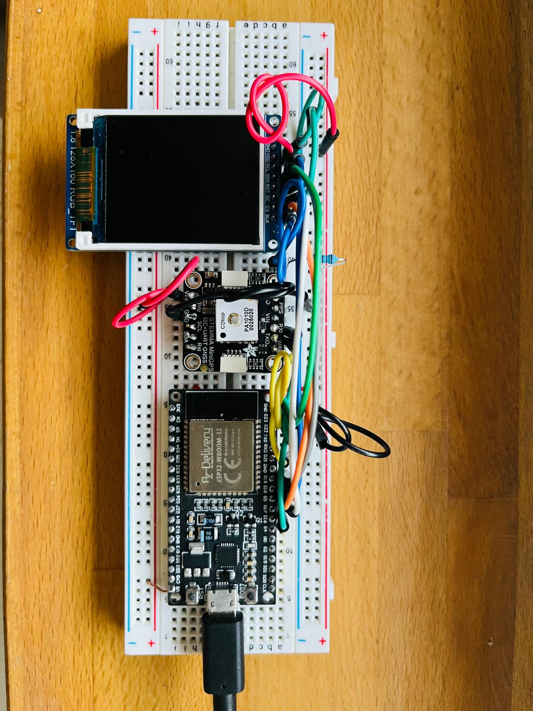
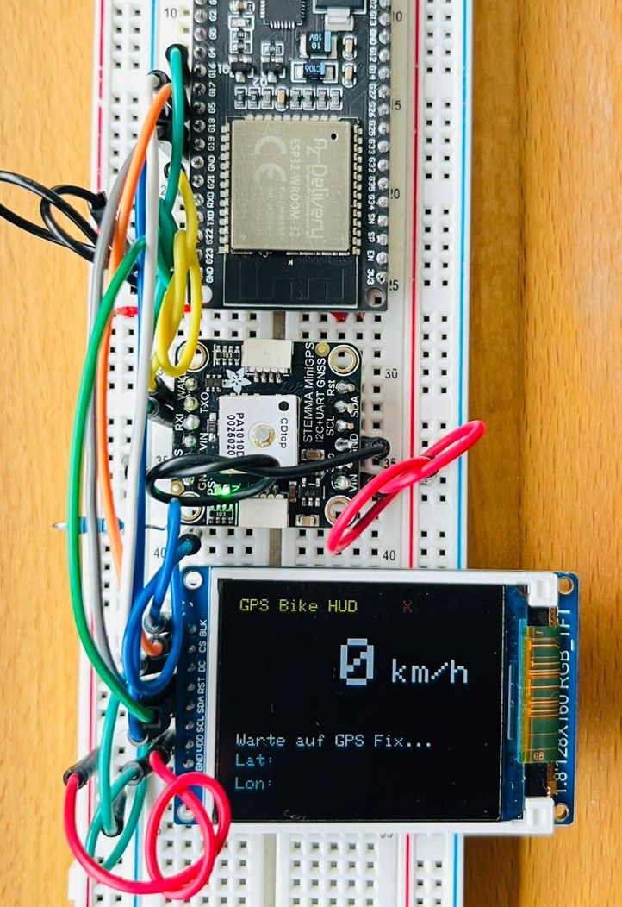
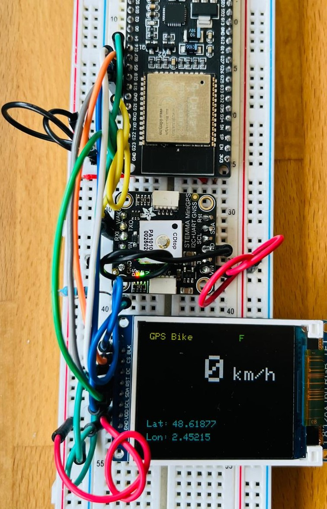

<<<<<<< HEAD
# ESP32 GPS Bike HUD

GPS-Tacho mit **ESP32**, **PA1010D (MTK3333)** und **1.8" ST7735 TFT**.  
Speed kommt aus dem **Doppler** (nicht aus Positionsdelta). 10 Hz, 115200 Baud.

## Features
- Echtzeitgeschwindigkeitsanzeige, **10 Hz**
- **UART2 115200** (RX=21, TX=16)
- EMA-Filter
- Fix-Status (F/X) + Lat/Lon

## Hardware / Pins
**GPS (PA1010D, UART):**
- TXO → ESP32 **GPIO21** (RX)
- RXI ← ESP32 **GPIO16** (TX)
- VIN → **5 V**, GND → GND

**TFT (ST7735, SPI):**
- SCK → **GPIO18**
- MOSI → **GPIO23**
- CS  → **GPIO5**
- DC  → **GPIO17**
- RST → **GPIO19**
- VDD → **3V3**, GND → GND  
*(kein MISO; `SPI.begin(18, -1, 23, 5)`)*
  
## Build (PlatformIO)
- Board: `esp32dev`
- Libs: Adafruit_GFX, Adafruit_ST7735, Adafruit_GPS, Adafruit_BusIO
- Monitor: `115200`

## NMEA/PMTK Setup
- Baud: **115200** (`PMTK251`)
- Sätze: **RMC + GGA** (`PMTK314`)
- Rate: **10 Hz** (`PMTK220`)
- Antennenstatus: `PGCMD,33,1`

## Bilder

=======
# ESP32 GPS Bike HUD

Kleiner GPS-Tacho mit **ESP32**, **PA1010D (MTK3333)** und **1.8" ST7735 TFT**.  
Speed kommt direkt aus dem **Doppler** (nicht Positions-Delta). 10 Hz, 115200 Baud.

## Features
- Echtzeit-Speed (Doppler) @ **10 Hz**
- **UART2 115200** (RX=21, TX=16)
- Flackerfreie Ganzzahlanzeige (km/h) + EMA-Filter
- Fix-Status (F/X) und Lat/Lon-Anzeige

## Hardware / Pins
**GPS (PA1010D, UART):**
- TXO → ESP32 **GPIO21** (RX)
- RXI ← ESP32 **GPIO16** (TX)
- VIN → **5 V**, GND → GND

**TFT (ST7735, SPI):**
- SCK → **GPIO18**
- MOSI → **GPIO23**
- CS  → **GPIO5**
- DC  → **GPIO17**
- RST → **GPIO19**
- VDD → **3V3**, GND → GND  
*(kein MISO; `SPI.begin(18, -1, 23, 5)`)*
  
## Build (PlatformIO)
- Board: `esp32dev`
- Libs: Adafruit_GFX, Adafruit_ST7735, Adafruit_GPS, Adafruit_BusIO
- Monitor: `115200`

## NMEA/PMTK Setup
- Baud: **115200** (`PMTK251`)
- Sätze: **RMC + GGA** (`PMTK314`)
- Rate: **10 Hz** (`PMTK220`)
- Antennenstatus: `PGCMD,33,1`

## Bilder

**Aufbau (Top)**

**Warte auf GPS Fix**

**Fix vorhanden (F)**

